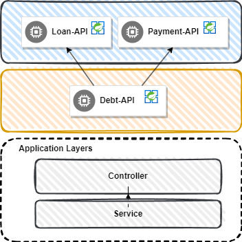

# **Debt API**

Debt API hace parte del proyecto challenge de prestamos, parte de las responsabilidades de Debt tienen que ver
con el calculo de la deuda teniendo en cuenta el registro de pagos y el monto del prestamo.

<br/>

# Solucion


Para la solucion se plantea un modelo multi-capa donde separamos las responsabilidades de los componentes asociados a cada una de ellas.

## Controller
En esta capa ubicamos los componentes que exponen las capcidades de nuestra API Restfull al cliente. Para esta implementacion usamos API Restfull.

## Service
En esta capa ubicamos la logica especializada de negocio, de esta forma mantenemos esta logica oculta del cliente y nos ayuda a generar desacoplamiento con la capa de presentacion(Controller).

# Tools
* ## Java version 11
* ## Framework Spring Boot
    * ### spring-boot-starter-web
    * ### lombok
    * ### spring-boot-starter-test

El framework principal que usamos para desarrollar la solucion es SpringBoot y nos apoyamos de las librerias listadas
anteriormente.
Cada una de ellas soportando las diferentes capas y requerimientos del challenge, entre ellas tenemos el starter-web,
que uno de sus principales aportes es soportar la capa controller para la exposicion de las API Restfull. Por otro lado
tenemos el starter-data-jpa que nos permite interactuar con mas facilidad con la base de datos y nos brinda notacion y
consultas prediseñadas para reducir la complejidad en la implementacion.
Lombok por su parte es una libreria que nos ayuda con el clean code, reduciendo la cantidad de lineas de codigo
repetitivas que escribimos en algunos componentes. Por ultimo pero no menos importante, starter-test nos aporta las
librerias de junit y mockito para la implementacion de las pruebas unitarias realizadas.

# Features
## Obtener la deuda
Permite obtener la deuda relacionada a un prestamo y el parametro date ayuda a determinar la deuda antes de la fecha 
ingresada.

#### /debts/loan/{loanId}?date=2022-10-03

###### Response body
```json
{
  "balance": 803104.02
}
```